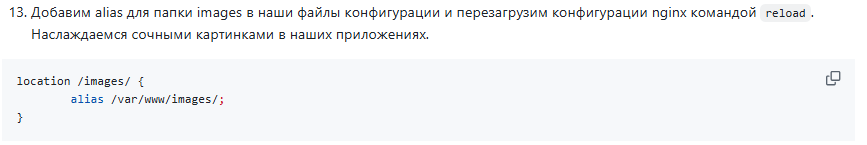
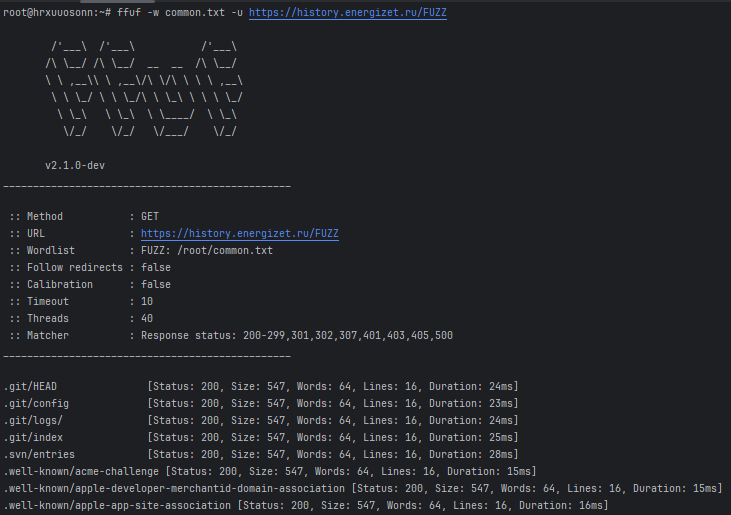
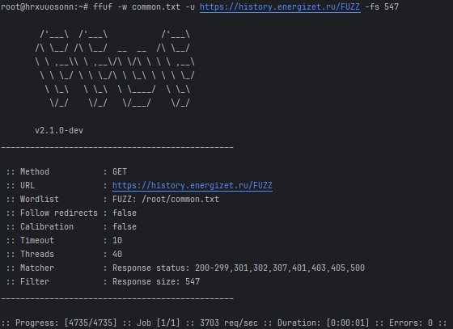
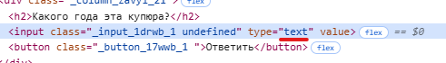
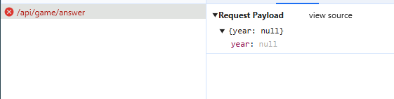
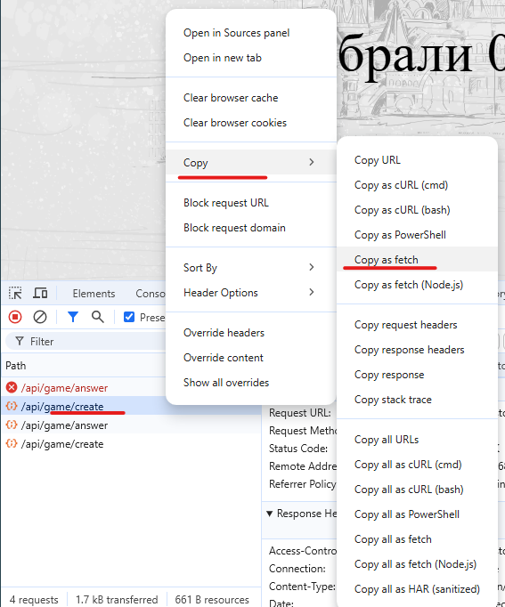
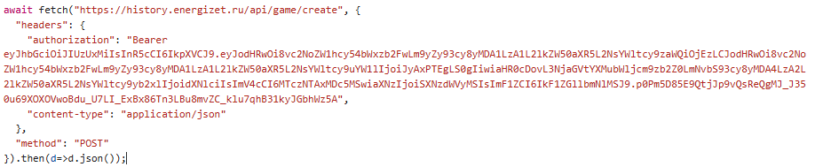
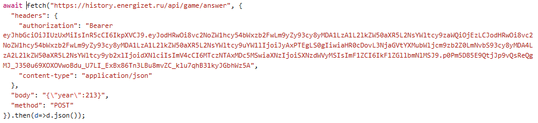
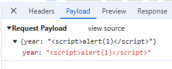
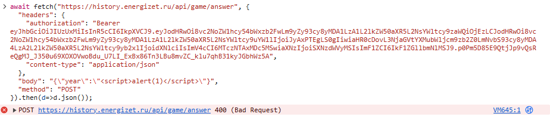

# README

## path traversal

Директива alias определяет замену для указанного местоположения. Например, со следующей конфигурацией:

```nginx configuration
location /i/ {
    alias /data/w3/images/;
}
```

По запросу /i/top.gif будет отправлен файл /data/w3/images/top.gif.

Но если местоположение не заканчивается на слеш:

```nginx configuration
location /i {
    alias /data/w3/images/;
}
```

то по запросу /i../app/config.py будет отправлен файл /data/w3/app/config.py.

изучив лабу одногрупника

`https://github.com/mikulitskii/optimization-methods/blob/main/lab1/README.md`



видим, что в местоположение указаны нужные слеши - значит уязвимости нет.

## ffuf

```
apt install ffuf
wget https://raw.githubusercontent.com/danielmiessler/SecLists/master/Discovery/Web-Content/common.txt
ffuf -w common.txt -u https://history.energizet.ru/FUZZ
```



Видим одинаковый размер файла, попробуем отфильтровать

```
ffuf -w common.txt -u https://history.energizet.ru/FUZZ -fs 547
```



Ничего

## xss и sql injection

xss - внедрение js скрипта, чтобы от отработал у другого пользователя
sql injection - внедрение sql, чтобы получить доступ к базе данных, например выташить информацию или её удалить

xss `<script>alert(1)</script>`
sql injection `' 1=1 --`

На сайте есть поле ввода логина, после ввода появляется логин, возможно он ещё где-то появляется


при вводе xss и sql видим просто вывод скрипта


Также есть поле для ввода ответов


в поле можно вводить только цифры выключим это




видим ошибку запроса



попробуем сделать запрос напрямую 





попробовав отправить строку получаем ошибку на сервере, можно передавать только число




xss и sql injection не найдены
