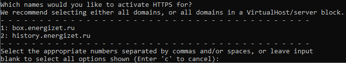
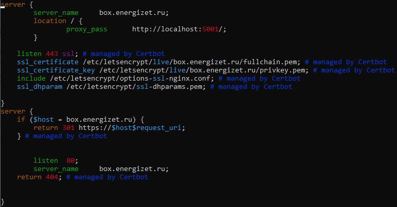
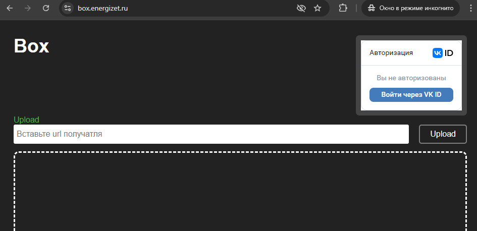
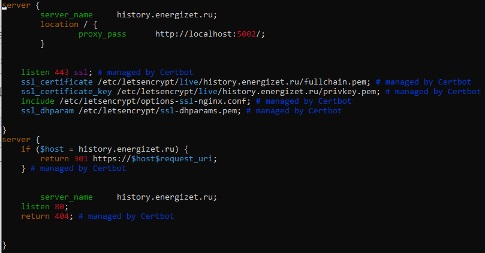
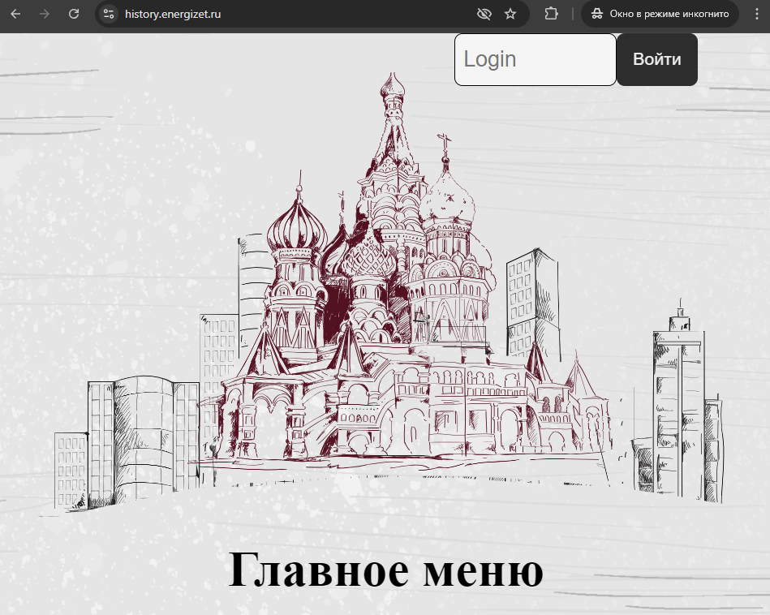

Сохраняем в папку `/var/box` первый проект\
Сохраняем в папку `/var/history` второй проект

Создаём файл `/lib/systemd/system/energizet-box.service` и записываем в него настройку демона который захостит первый проект

	[Unit]
	Description=Energizet Box service

	[Service]
	Type=simple
	WorkingDirectory=/var/box
	ExecStart=/var/box/Energizet.Box.Web --urls=http://localhost:5001

	[Install]
	WantedBy=multi-user.target

Запускаем хостинг первого проекта

    systemctl start energizet-box.service
    systemctl enable energizet-box.service

Создаём файл `/lib/systemd/system/energizet-history.service` и записываем в него настройку демона который захостит второй проект

	[Unit]
	Description=Energizet History service

	[Service]
	Type=simple
	WorkingDirectory=/var/history
	ExecStart=/var/history/Histoty.Storublioner.Web --urls=http://localhost:5002

	[Install]
	WantedBy=multi-user.target

Запускаем хостинг второго проекта

    systemctl start energizet-history.service
    systemctl enable energizet-history.service

Создаём файл `/etc/nginx/conf.d/energizet-box.conf` и в него записываем первоначальную настройку nginx для первого проекта

	server {
        server_name     box.energizet.ru;
        location / {
            proxy_pass      http://localhost:5001/;
        }
	}

Создаём файл `/etc/nginx/conf.d/energizet-history.conf` и в него записываем первоначальную настройку nginx для второго проекта

	server {
        server_name     history.energizet.ru;
        location / {
            proxy_pass      http://localhost:5002/;
        }
	}

Устанавливаем certbot

    apt install snapd
    snap install --classic certbot
    ln -s /snap/bin/certbot /usr/bin/certbot

Запускаем `certbot --nginx` и выбираем первый проект

В результате получим такой конфиг `/etc/nginx/conf.d/energizet-box.conf`

Запускаем `certbot --nginx` и выбираем второй проект

В результате получим такой конфиг `/etc/nginx/conf.d/energizet-history.conf`

