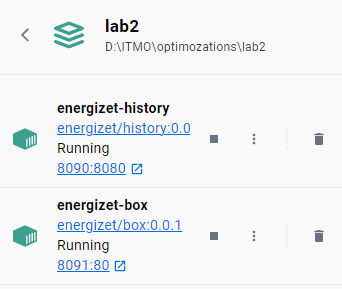
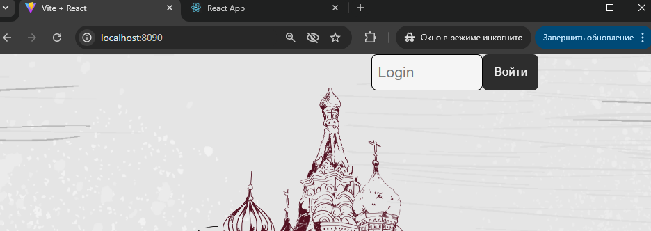
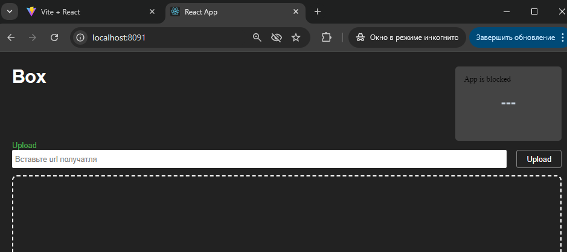

# README

## Плохой `docker-compose.yml`

```yaml
version: "3"
services:

  energizet-history:
    image: energizet/history:latest
    container_name: energizet-history
    restart: always
    ports:
      - "8090:8080"
    networks:
      - app-network
    volumes:
      - ./history/wwwroot:/app/wwwroot
      - ./history/store:/app/store

  energizet-box:
    image: energizet/box:latest
    container_name: energizet-box
    restart: always
    ports:
      - "8091:80"
    networks:
      - app-network
    volumes:
      - ./box/wwwroot:/app/wwwroot
      - ./box/db:/app/db

networks:
  app-network:
    driver: bridge
```

## Хороший `docker-compose.yml`

```yaml
version: "3.8"
services:

  energizet-history:
    image: energizet/history:0.0.1
    container_name: energizet-history
    restart: unless-stopped
    ports:
      - "8090:8080"
    networks:
      - app-network
    volumes:
      - ./history/wwwroot:/app/wwwroot
      - ./history/store:/app/store

  energizet-box:
    image: energizet/box:0.0.1
    container_name: energizet-box
    restart: unless-stopped
    ports:
      - "8091:80"
    networks:
      - app-network
    volumes:
      - ./box/wwwroot:/app/wwwroot
      - ./box/db:/app/db

networks:
  app-network:
    driver: bridge

```





## Описание плохих практик в "плохом" Docker Compose файле и их исправление

### 1. **Использование версии Compose ниже 3.8**

**Плохая практика:**
В "плохом" файле используется версия 3, хотя рекомендуется использовать версию `3.8` и выше для большей совместимости с последними функциями Docker, такими как более гибкая работа с сетями, поддержка сервисов, масштабирование и улучшенные политики перезапуска.

**Исправление:**
В "хорошем" файле указана версия `3.8`, что позволяет использовать более новые и гибкие возможности Docker Compose.

**Результат:**
- Улучшенная совместимость с новыми версиями Docker.
- Поддержка новых функций, таких как гибкое управление сетями и политиками масштабирования.

---

### 2. **Использование "latest" тега для образов**

**Плохая практика:**
В "плохом" файле используется тег `latest` для образов (`image: energizet/history:latest` и `image: energizet/box:latest`). Тег `latest` указывает на самую последнюю доступную версию образа, что делает сборку нестабильной, так как при каждом обновлении `latest` может получить новую версию с несовместимыми изменениями.

**Исправление:**
В "хорошем" файле указываются конкретные версии образов, например `image: energizet/history:0.0.1` и `image: energizet/box:0.0.1`. Это обеспечивает стабильность сборки и гарантирует, что при каждом запуске будет использоваться одна и та же версия, если специально не будет изменена.

**Результат:**
- Стабильность окружения, так как образы не будут внезапно обновляться.
- Уменьшение риска несовместимых изменений и ошибок.

---

### 3. **Использование `restart: always` вместо `restart: unless-stopped`**

**Почему это плохо:**
Параметр `restart: always` указывает контейнеру всегда перезапускаться, даже если он был вручную остановлен администратором. Это неудобно и мешает при обновлениях и устранении проблем, так как контейнер может автоматически перезапуститься при попытке диагностики.

**Исправление:**
Используем `restart: unless-stopped` в "хорошем" файле, чтобы контейнер не перезапускался, если он был остановлен вручную, что улучшает управляемость и предсказуемость поведения контейнера.

**Результат:**
Большее удобство при управлении контейнером и меньшее количество нежелательных автоматических перезапусков.

---

## Изоляция контейнеров в "хорошем" Docker Compose файле

Для того чтобы контейнеры в рамках одного Compose-проекта не "видели" друг друга по сети, нужно настроить их на разных сетях. Однако, если требуется, чтобы контейнеры запускались в одном проекте, но не могли взаимодействовать друг с другом через сеть, можно создать для каждого контейнера свою отдельную сеть, таким образом ограничив их сетевое взаимодействие.

### Измененный `docker-compose.yml` для изоляции контейнеров:

```yaml
version: "3.8"
services:

  energizet-history:
    image: energizet/history:0.0.1
    container_name: energizet-history
    restart: unless-stopped
    ports:
      - "8090:8080"
    networks:
      - history-network
    volumes:
      - ./history/wwwroot:/app/wwwroot
      - ./history/store:/app/store

  energizet-box:
    image: energizet/box:0.0.1
    container_name: energizet-box
    restart: unless-stopped
    ports:
      - "8091:80"
    networks:
      - box-network
    volumes:
      - ./box/wwwroot:/app/wwwroot
      - ./box/db:/app/db

networks:
  history-network:
    driver: bridge
  box-network:
    driver: bridge
```

### Принцип изоляции:

**Создание отдельных сетей для каждого сервиса:**
В этом файле для сервиса `energizet-history` и сервиса `energizet-box` созданы разные сети: `history-network` и `box-network`. Это позволяет каждому контейнеру находиться в своей сети, предотвращая их взаимодействие через стандартные сетевые механизмы Docker.

**Изоляция через bridge-сети:**
Docker использует драйвер `bridge` для создания изолированных сетевых пространств для каждого контейнера. При настройке нескольких сетей с использованием драйвера `bridge` контейнеры, подключенные к разным сетям, не могут обмениваться данными напрямую.

**Результат:**
Контейнеры "видят" внешнюю сеть и могут получать входящие соединения (через настройку `ports`), но при этом не имеют сетевого доступа друг к другу.
