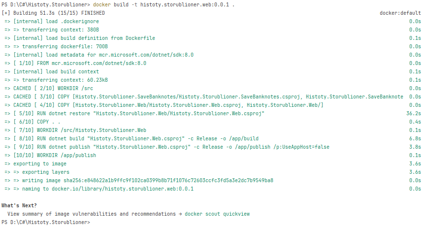
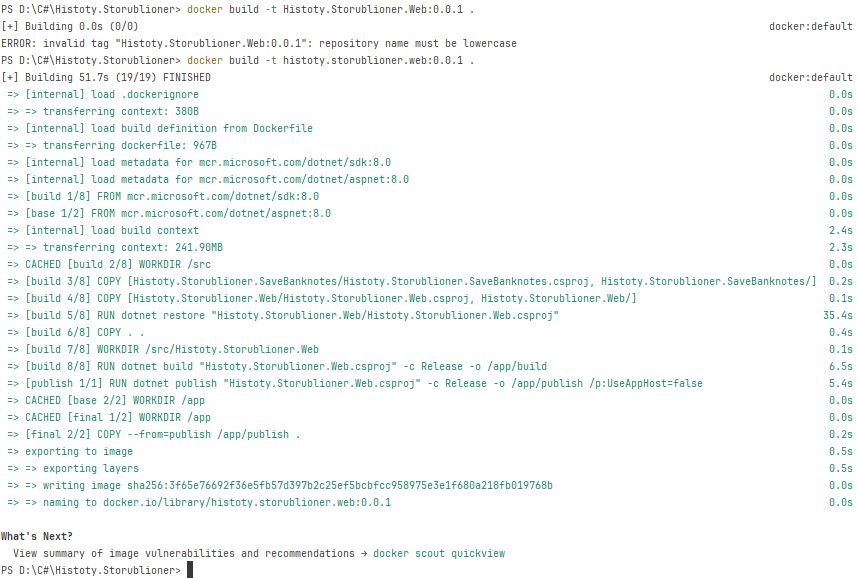

# README

## Плохой Dockerfile

```dockerfile
FROM mcr.microsoft.com/dotnet/sdk:8.0
WORKDIR /src
COPY ["Histoty.Storublioner.SaveBanknotes/Histoty.Storublioner.SaveBanknotes.csproj", "Histoty.Storublioner.SaveBanknotes/"]
COPY ["Histoty.Storublioner.Web/Histoty.Storublioner.Web.csproj", "Histoty.Storublioner.Web/"]
RUN dotnet restore "Histoty.Storublioner.Web/Histoty.Storublioner.Web.csproj"
COPY . .
WORKDIR "/src/Histoty.Storublioner.Web"
RUN dotnet build "Histoty.Storublioner.Web.csproj" -c Release -o /app/build
RUN dotnet publish "Histoty.Storublioner.Web.csproj" -c Release -o /app/publish /p:UseAppHost=false
WORKDIR /app/publish
ENTRYPOINT ["dotnet", "Histoty.Storublioner.Web.dll"]
```



## Хорошой Dockerfile

```dockerfile
FROM mcr.microsoft.com/dotnet/aspnet:8.0 AS base
USER app
WORKDIR /app
EXPOSE 8080

FROM mcr.microsoft.com/dotnet/sdk:8.0 AS build
ARG BUILD_CONFIGURATION=Release
WORKDIR /src
COPY ["Histoty.Storublioner.SaveBanknotes/Histoty.Storublioner.SaveBanknotes.csproj", "Histoty.Storublioner.SaveBanknotes/"]
COPY ["Histoty.Storublioner.Web/Histoty.Storublioner.Web.csproj", "Histoty.Storublioner.Web/"]
RUN dotnet restore "Histoty.Storublioner.Web/Histoty.Storublioner.Web.csproj"
COPY . .
WORKDIR "/src/Histoty.Storublioner.Web"
RUN dotnet build "Histoty.Storublioner.Web.csproj" -c $BUILD_CONFIGURATION -o /app/build

FROM build AS publish
ARG BUILD_CONFIGURATION=Release
RUN dotnet publish "Histoty.Storublioner.Web.csproj" -c $BUILD_CONFIGURATION -o /app/publish /p:UseAppHost=false

FROM base AS final
WORKDIR /app
COPY --from=publish /app/publish .
ENTRYPOINT ["dotnet", "Histoty.Storublioner.Web.dll"]
```



## Описание плохих практик в "плохом" Dockerfile и их исправление

### 1. **Использование одного слоя для сборки и выполнения приложения**

**Плохая практика:**
В "плохом" Dockerfile процесс сборки (`dotnet build` и `dotnet publish`) происходит в том же контейнере, что и выполнение приложения. Это ведет к тому, что в финальном образе остаются лишние файлы и зависимости, использованные только на этапе сборки. Такой подход увеличивает размер финального образа, делает его менее оптимизированным и более уязвимым к утечке данных.

**Исправление:**
В "хорошем" Dockerfile применяется многослойная структура: есть отдельные слои для этапов сборки и выполнения. В результате, файлы и зависимости, используемые для сборки, не попадают в финальный образ, что значительно уменьшает его размер и делает его более безопасным и эффективным.

**Результат:**
- Уменьшение размера финального образа.
- Сокращение времени загрузки и развертывания.
- Увеличение безопасности за счет удаления лишних файлов и зависимостей.

---

### 2. **Отсутствие пользователя в контейнере**

**Плохая практика:**
По умолчанию контейнеры запускаются под root-пользователем. В "плохом" Dockerfile пользователь не задается, что создает риск безопасности: если хакер получит доступ к контейнеру, он получит root-доступ ко всей системе, что потенциально позволяет ему изменять или удалять критические файлы.

**Исправление:**
В "хорошем" Dockerfile добавлен пользователь `app`, который не обладает root-правами. Это ограничивает действия внутри контейнера и снижает риск потенциальных атак.

**Результат:**
- Повышение уровня безопасности контейнера за счет ограничения прав доступа.
- Меньше рисков для основной системы в случае компрометации контейнера.

---

### 3. **Отсутствие переменных окружения и жестко закодированные конфигурации**

**Плохая практика:**
В "плохом" Dockerfile конфигурация (например, `dotnet build -c Release`) жестко закодирована, и изменение этих параметров требует правки самого Dockerfile. Это делает процесс сборки менее гибким.

**Исправление:**
В "хорошем" Dockerfile использованы переменные окружения (`ARG BUILD_CONFIGURATION=Release`). Это позволяет задавать различные конфигурации при запуске, не изменяя сам Dockerfile. Такой подход делает процесс сборки гибким и удобным для различных сред (development, staging, production).

**Результат:**
- Повышенная гибкость при сборке образов для разных конфигураций.
- Уменьшение ошибок из-за изменения кодов конфигурации непосредственно в Dockerfile.

---

## Плохие практики при работе с контейнерами

### 1. **Хранение состояния внутри контейнера**

**Описание:**
Контейнеры, по своей сути, предназначены для stateless-приложений, где данные не сохраняются внутри контейнера, а хранятся в специальных внешних системах хранения, таких как базы данных или volume-тома. Однако часто контейнеры используют как stateful, например, для хранения логов или данных.

**Почему это плохо:**
- При перезапуске контейнера все данные, хранимые внутри него, будут потеряны.
- Это усложняет масштабирование приложения, так как разные контейнеры могут содержать разные состояния.

**Как избежать:**
Храните все данные вне контейнера с помощью volumes или удаленных систем хранения. Это обеспечит сохранение данных независимо от работы контейнера.

---

### 2. **Отсутствие лимитов на ресурсы контейнера**

**Описание:**
Контейнеры, не ограниченные по использованию ресурсов (CPU, RAM), могут "съесть" все доступные системные ресурсы, если приложение ведет себя некорректно или подвергнется нагрузке.

**Почему это плохо:**
- Такой контейнер может "задушить" другие процессы или контейнеры на той же системе, приводя к падению всего сервера.
- Неконтролируемое потребление ресурсов снижает стабильность системы.

**Как избежать:**
Используйте флаги `--memory` и `--cpus` для установки лимитов на использование памяти и процессоров. Это обеспечит предсказуемость поведения контейнеров и улучшит стабильность системы.
