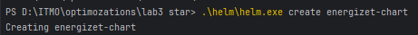
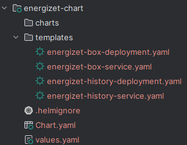
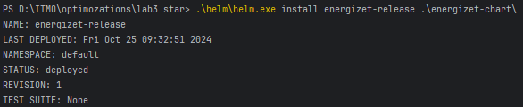
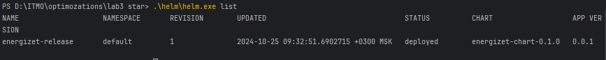
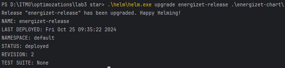
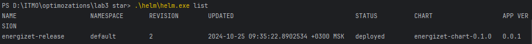

## Создание Helm-чарта

### Создайте новый Helm-чарт:

### Структура каталога:

### Установка сервиса в кластер

### Обновление сервиса

## Причины использования Helm:

**Управление версиями:**
Helm позволяет легко управлять версиями приложений, обеспечивая простоту отката и обновления.

**Упрощение развертывания:**
Helm-чарты позволяют упаковывать все ресурсы Kubernetes в одном месте, упрощая их развертывание и управление.

**Параметризация:**
Вы можете легко изменять конфигурацию через values.yaml, что позволяет адаптировать приложение под различные среды без изменения манифестов.
