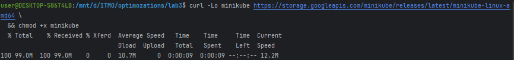
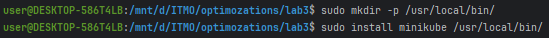
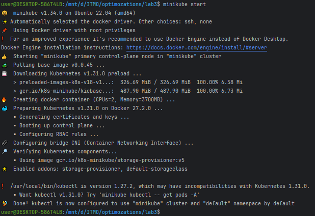
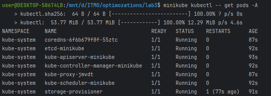
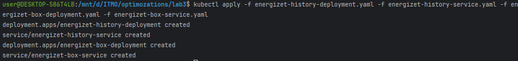
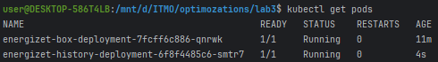
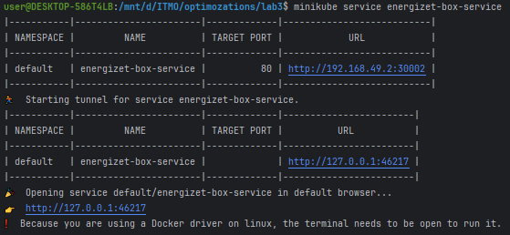
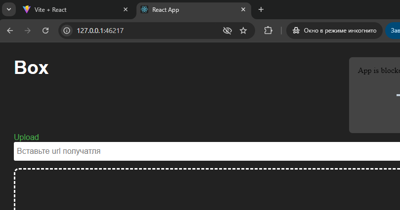
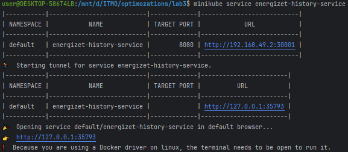
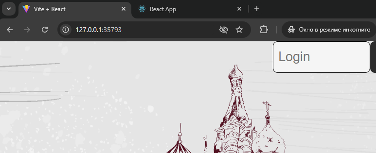

### `energizet-box-deployment.yaml`

```yaml
apiVersion: apps/v1
kind: Deployment
metadata:
  name: energizet-box-deployment
spec:
  replicas: 1
  selector:
    matchLabels:
      app: energizet-box
  template:
    metadata:
      labels:
        app: energizet-box
    spec:
      containers:
        - name: energizet-box
          image: energizet/box:0.0.1
          ports:
            - containerPort: 80
          volumeMounts:
            - name: wwwroot
              mountPath: /app/wwwroot
            - name: db
              mountPath: /app/db
      volumes:
        - name: wwwroot
          hostPath:
            path: /home/user/box/wwwroot
        - name: db
          hostPath:
            path: /home/user/box/db
```

### `energizet-box-service.yaml`

```yaml
apiVersion: v1
kind: Service
metadata:
  name: energizet-box-service
spec:
  type: NodePort
  ports:
    - port: 80
      targetPort: 80
      nodePort: 30002
  selector:
    app: energizet-box
```

### `energizet-history-deployment.yaml`

```yaml
apiVersion: apps/v1
kind: Deployment
metadata:
  name: energizet-history-deployment
spec:
  replicas: 1
  selector:
    matchLabels:
      app: energizet-history
  template:
    metadata:
      labels:
        app: energizet-history
    spec:
      containers:
        - name: energizet-history
          image: energizet/history:0.0.1
          ports:
            - containerPort: 8080
          volumeMounts:
            - name: wwwroot
              mountPath: /app/wwwroot
            - name: store
              mountPath: /app/store
      volumes:
        - name: wwwroot
          hostPath:
            path: /home/user/history/wwwroot
        - name: store
          hostPath:
            path: /home/user/history/store
```

### `energizet-history-service.yaml`

```yaml
apiVersion: v1
kind: Service
metadata:
  name: energizet-history-service
spec:
  type: NodePort
  ports:
    - port: 8080
      targetPort: 8080
      nodePort: 30001
  selector:
    app: energizet-history
```

## Установка `minicube`





## Установка `kubectl`



## Применение yaml файлов



## Запуск сервисов






