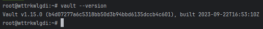
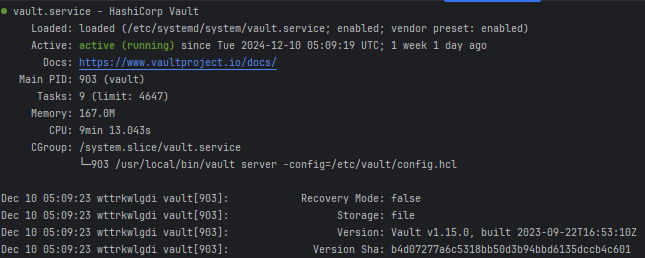
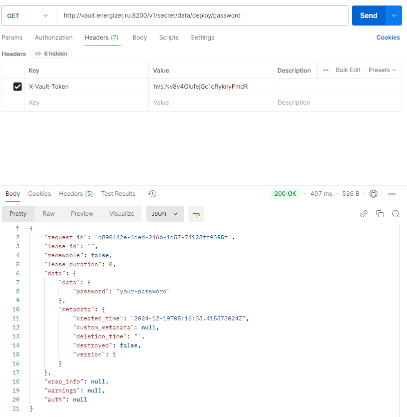
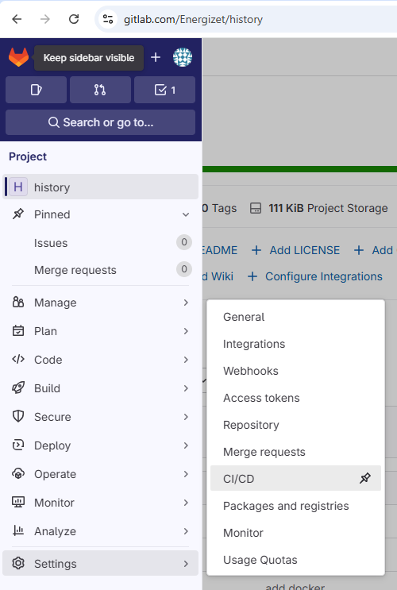
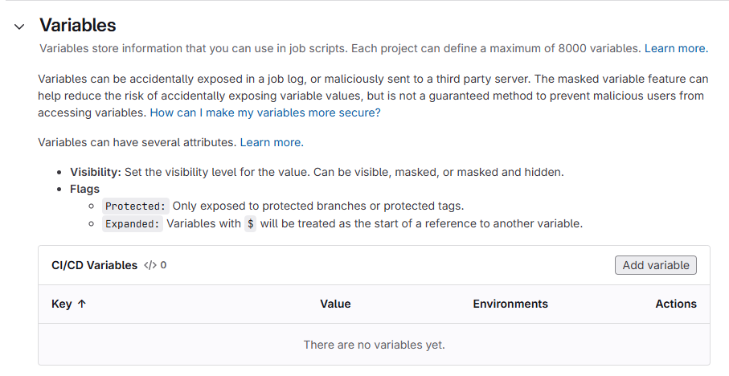
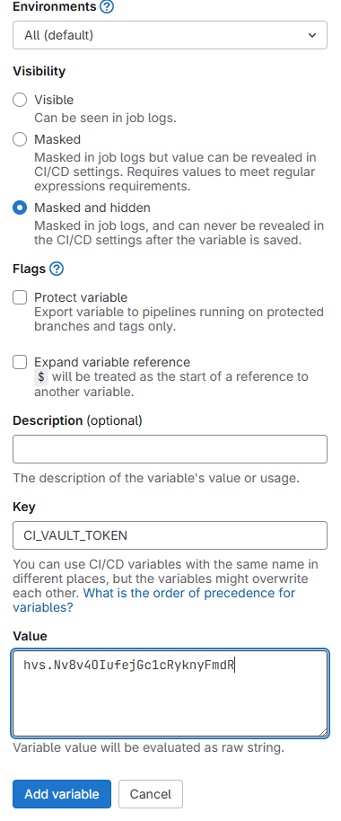
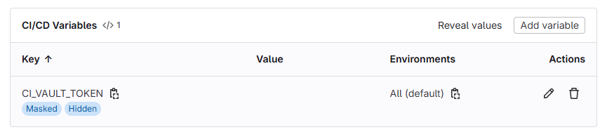

# README

```
wget https://releases.hashicorp.com/vault/1.15.0/vault_1.15.0_linux_amd64.zip
unzip vault_1.15.0_linux_amd64.zip
sudo mv vault /usr/local/bin/
vault --version
```



```
sudo useradd --system --home /var/lib/vault --shell /bin/false vault
sudo mkdir -p /etc/vault
sudo chown -R vault:vault /etc/vault
sudo mkdir -p /var/lib/vault/data
sudo chown -R vault:vault /var/lib/vault
```

`vi /etc/vault/config.hcl`

```
storage "file" {
  path = "/var/lib/vault/data"
}

listener "tcp" {
  address     = "0.0.0.0:8200"
  tls_disable = 1
}

ui = true
disable_mlock = true
```

`vi /etc/systemd/system/vault.service`

```
[Unit]
Description=HashiCorp Vault
Documentation=https://www.vaultproject.io/docs/
After=network-online.target
Wants=network-online.target

[Service]
User=vault
Group=vault
ExecStart=/usr/local/bin/vault server -config=/etc/vault/config.hcl
ExecReload=/bin/kill -HUP $MAINPID
Restart=on-failure
LimitNOFILE=65536

[Install]
WantedBy=multi-user.target
```

```
sudo systemctl daemon-reload
sudo systemctl enable vault
sudo systemctl start vault
sudo systemctl status vault
```



```
export VAULT_ADDR='http://127.0.0.1:8200'
vault operator init
```

```
Unseal Key 1: VkIjRyHvji0L8/koxZeWBf/Qj/juOALbnKHupvhqF+CD
Unseal Key 2: u1MJHqqjdxTD1xKSNj5PYPT115RG1x2TuJEuVA+AzpaJ
Unseal Key 3: FQsQutRXJLNKAjTiqBZ2QkqJoDi9cdPwrxsjGl04Ciy3
Unseal Key 4: zIoHzTETnFkdEhjjqFfiIcxTw+boQicPNgxDZLLWNMpa
Unseal Key 5: VhG4D3k/ZvW3DXmV5OtIjT4k6y2+Xu/KZ66PBVA64pHS

Initial Root Token: hvs.Nv8v4OIufejGc1cRyknyFmdR

Vault initialized with 5 key shares and a key threshold of 3. Please securely
distribute the key shares printed above. When the Vault is re-sealed,
restarted, or stopped, you must supply at least 3 of these keys to unseal it
before it can start servicing requests.

Vault does not store the generated root key. Without at least 3 keys to
reconstruct the root key, Vault will remain permanently sealed!

It is possible to generate new unseal keys, provided you have a quorum of
existing unseal keys shares. See "vault operator rekey" for more information.
```

```
vault operator unseal VkIjRyHvji0L8/koxZeWBf/Qj/juOALbnKHupvhqF+CD
vault operator unseal u1MJHqqjdxTD1xKSNj5PYPT115RG1x2TuJEuVA+AzpaJ
vault operator unseal FQsQutRXJLNKAjTiqBZ2QkqJoDi9cdPwrxsjGl04Ciy3
```

```
Key             Value
---             -----
Seal Type       shamir
Initialized     true
Sealed          false
Total Shares    5
Threshold       3
Version         1.15.0
Build Date      2023-09-22T16:53:10Z
Storage Type    file
Cluster Name    vault-cluster-55f69b63
Cluster ID      d172fba1-438f-a971-8f1d-341cbad38623
HA Enabled      false
```

```
vault login hvs.Nv8v4OIufejGc1cRyknyFmdR
vault secrets enable -path=secret kv-v2
vault kv put secret/deploy/password password="your-password"
```







## Пайплайн с использованием HashiCorp Vault

```yaml
stages:
  - test
  - build
  - deploy

variables:
  DOCKER_DRIVER: overlay2
  VAULT_ADDR: "http://vault.energizet.ru:8200"
  VAULT_TOKEN: "$CI_VAULT_TOKEN"
  VAULT_SECRET_PATH: "secret/data/deploy/password"
  IMAGE_NAME: "energizet/history"
  IMAGE_TAG: "latest"

test:
  stage: test
  image: mcr.microsoft.com/dotnet/sdk:8.0
  only:
    - merge_requests
    - master
  script:
    - dotnet test Histoty.Storublioner.Tests/Histoty.Storublioner.Tests.csproj --logger:trx
    - exit $CI_PIPELINE_STATUS

build:
  stage: build
  image: docker:latest
  services:
    - docker:dind
  only:
    - merge_requests
  script:
    - docker build -t $IMAGE_NAME:$IMAGE_TAG .

build_master:
  stage: build
  extends: build
  only:
    - master
  after_script:
    - docker save $IMAGE_NAME:$IMAGE_TAG -o history_image.tar
  artifacts:
    paths:
      - history_image.tar
    expire_in: 1 hour

deploy:
  stage: deploy
  image: docker:latest
  services:
    - docker:dind
  only:
    - master
  when: manual
  before_script:
    - apk update && apk add curl jq
    - >
      export DEPLOY_PASSWORD=$(curl -s --header "X-Vault-Token: $VAULT_TOKEN" \
        $VAULT_ADDR/v1/$VAULT_SECRET_PATH | jq -r '.data.data.password')
    - echo $DEPLOY_PASSWORD | docker login -u energizet --password-stdin
    - docker load -i history_image.tar
  script:
    - docker push $IMAGE_NAME:$IMAGE_TAG
```

## Почему хранение секретов в CI/CD переменных репозитория — плохая практика?

1. **Уязвимость к утечкам**:
   CI/CD переменные репозитория (например, в GitLab) могут быть доступны на разных этапах пайплайна, особенно если
   доступ к репозиторию имеют различные пользователи и сервисы. Это увеличивает шанс утечки данных, особенно если кто-то
   из разработчиков случайно использует их в логах или коммитах.

2. **Нет централизованного управления доступом**:
   Когда секреты хранятся непосредственно в репозитории или CI/CD, управление доступом становится трудным. Это особенно
   важно, если в проекте работают несколько команд или сервисов, которым требуется различный уровень доступа к секретам.

3. **Отсутствие аудита и журналирования**:
   Хранение секретов в репозитории не предоставляет возможности для централизованного мониторинга и аудита. Вы не можете
   отслеживать, кто и когда получил доступ к секрету, что снижает уровень безопасности.

4. **Проблемы с изменением секретов**:
   При изменении секретов вам необходимо вручную обновлять их в каждом репозитории или конфигурации, что увеличивает
   вероятность ошибок и утечек.

---

## Преимущества использования HashiCorp Vault:

1. **Централизованное управление секретами**:
   Секреты хранятся в одном месте (HashiCorp Vault), и доступ к ним осуществляется через безопасные каналы с
   использованием API.

2. **Политики и контроль доступа**:
   С помощью Vault можно настроить строгие политики доступа, определяя, кто и как может получить доступ к конкретным
   секретам. Это значительно повышает безопасность.

3. **Шифрование данных**:
   Все данные в HashiCorp Vault шифруются, а доступ к ним осуществляется через зашифрованные каналы, что защищает
   секреты даже при компрометации сети.

4. **Временные и динамические секреты**:
   Vault поддерживает генерацию временных или динамических секретов, которые имеют ограниченный срок действия, что
   добавляет дополнительный уровень безопасности.

5. **Аудит и мониторинг**:
   Vault предоставляет встроенные возможности для аудита всех запросов и операций, что позволяет отслеживать доступ к
   секретам.
