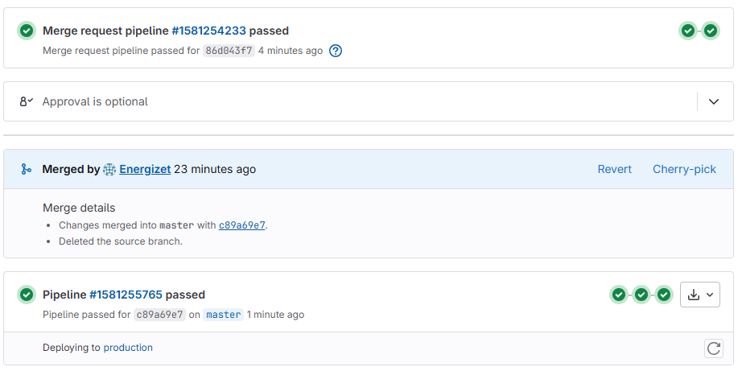
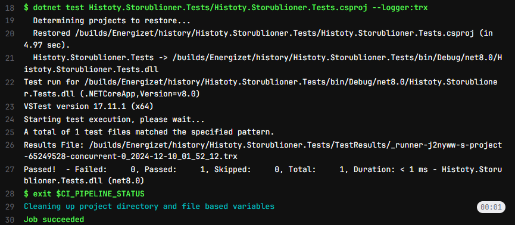
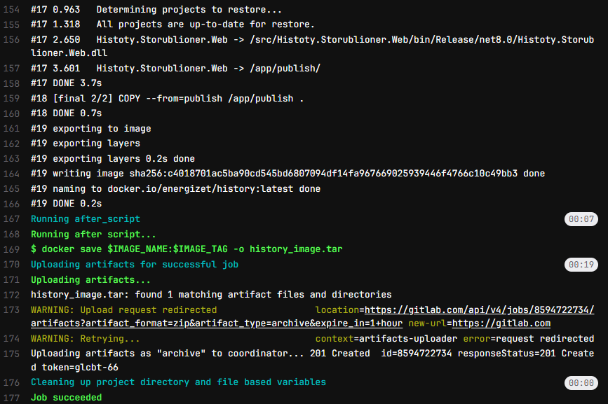
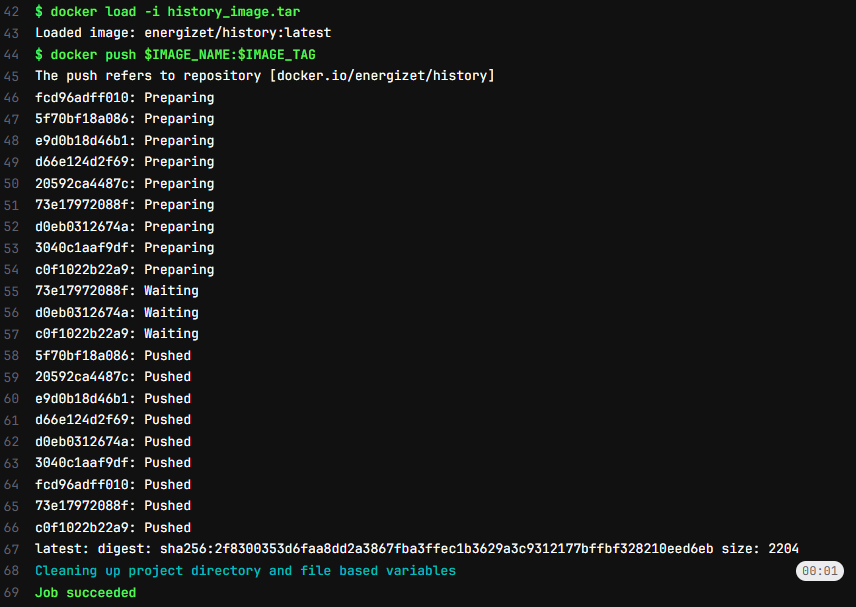

# README

## Плохой .gitlab-ci.yml

```yaml
stages:
  - deploy

variables:
  DOCKER_DRIVER: overlay2

deploy:
  stage: deploy
  image: docker:latest
  services:
    - docker:dind
  before_script:
    - docker login -u energizet -p mysecretpassword
    - docker build -t energizet/history:latest .
    - docker push energizet/history:latest
```

## Хороший .gitlab-ci.yml

```yaml
stages:
  - test
  - build
  - deploy

variables:
  DOCKER_DRIVER: overlay2
  VAULT_ADDR: "http://vault.energizet.ru:8200"
  VAULT_TOKEN: "$CI_VAULT_TOKEN"
  VAULT_SECRET_PATH: "secret/data/deploy/password"
  IMAGE_NAME: "energizet/history"
  IMAGE_TAG: "latest"

test:
  stage: test
  image: mcr.microsoft.com/dotnet/sdk:8.0
  only:
    - merge_requests
    - master
  script:
    - dotnet test Histoty.Storublioner.Tests/Histoty.Storublioner.Tests.csproj --logger:trx
    - exit $CI_PIPELINE_STATUS

build:
  stage: build
  image: docker:latest
  services:
    - docker:dind
  only:
    - merge_requests
  script:
    - docker build -t $IMAGE_NAME:$IMAGE_TAG .

build_master:
  stage: build
  extends: build
  only:
    - master
  after_script:
    - docker save $IMAGE_NAME:$IMAGE_TAG -o history_image.tar
  artifacts:
    paths:
      - history_image.tar
    expire_in: 1 hour

deploy:
  stage: deploy
  image: docker:latest
  services:
    - docker:dind
  only:
    - master
  when: manual
  before_script:
    - apk update && apk add curl jq
    - >
      export DEPLOY_PASSWORD=$(curl -s --header "X-Vault-Token: $VAULT_TOKEN" \
        $VAULT_ADDR/v1/$VAULT_SECRET_PATH | jq -r '.data.password')
    - echo $DEPLOY_PASSWORD | docker login -u energizet --password-stdin
    - docker load -i history_image.tar
  script:
    - docker push $IMAGE_NAME:$IMAGE_TAG
```

### Почему это плохо?

1. **Нет разделения на этапы**:
   Вся логика пайплайна сведена к одному этапу деплоя. Это затрудняет управление процессом и диагностику проблем, так
   как все шаги происходят в одном месте.

   **Решение**:
   Пайплайн теперь разделен на три четко определенных этапа: **test**, **build**, и **deploy**.
    - Этап **test** проверяет корректность работы приложения с помощью юнит-тестов.
    - Этап **build** отвечает за сборку Docker-образа.
    - Этап **deploy** выполняется вручную, только на ветке **master**, и после успешной сборки и тестирования.

   Это улучшает читаемость и поддержку пайплайна, позволяет изолировать проблемы на разных этапах.

2. **Образ автоматически загружается в Docker Hub**:
   Пайплайн автоматически строит и пушит образ в Docker Hub, даже если код еще не был протестирован. Это может привести
   к тому, что в репозиторий попадет неисправный или незавершённый образ.

   **Решение**: Образ пушится в Docker Hub только после того, как был успешно собран и протестирован.

   Это предотвращает загрузку дефектных образов, гарантируя, что в репозиторий попадут только стабильные и
   протестированные версии приложения.

3. **Пароль указан в пайплайне**:
   В пайплайне используется явное указание пароля для аутентификации в Docker Hub (
   `docker login -u energizet -p mysecretpassword`). Это может привести к утечке чувствительных данных.

   **Решение**: Пароль для деплоя теперь извлекается из **HashiCorp Vault**, а не указывается напрямую в пайплайне.

   Это увеличивает безопасность пайплайна, предотвращая утечку секретных данных, таких как пароли, и
   упрощает управление доступом.

4. **Нет тестов**:
   Пайплайн не включает этапы для проверки корректности кода через тесты. Без тестирования перед деплоем можно случайно
   загрузить баги в продакшн.

   **Решение**: Этап **test** запускает юнит-тесты, проверяя, что приложение работает корректно.

   Тестирование позволяет убедиться, что код работает должным образом перед деплоем, минимизируя риск
   введения ошибок в продакшн.

5. **Запуск пайплайна при каждом коммите**:
   Пайплайн запускается при каждом коммите, что приводит к лишней нагрузке на систему и может быть неэффективно, так как
   не все коммиты требуют полноценного пайплайна.

   **Решение**: Пайплайн запускается только при создании **merge request** или при мердже в ветку **master**. Этапы
   **test** и **build** выполняются только при создании МР или при мердже в мастер, а деплой запускается вручную.

   Это экономит ресурсы, так как пайплайн не запускается для каждого коммита, и упрощает процесс
   разработки, концентрируясь только на значимых изменениях в коде.

---





