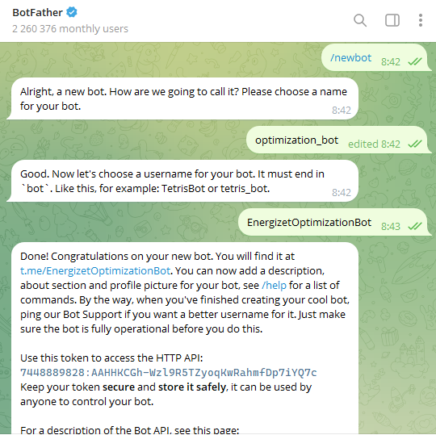
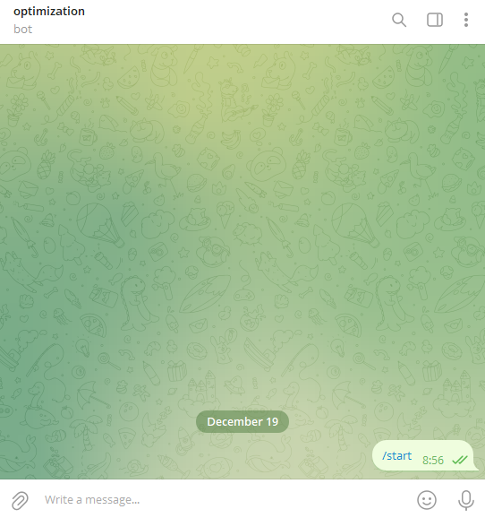
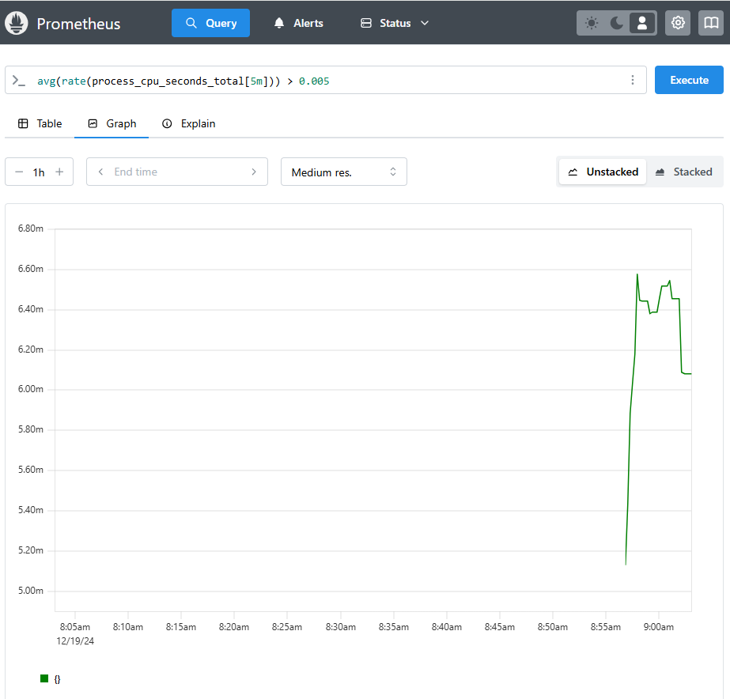
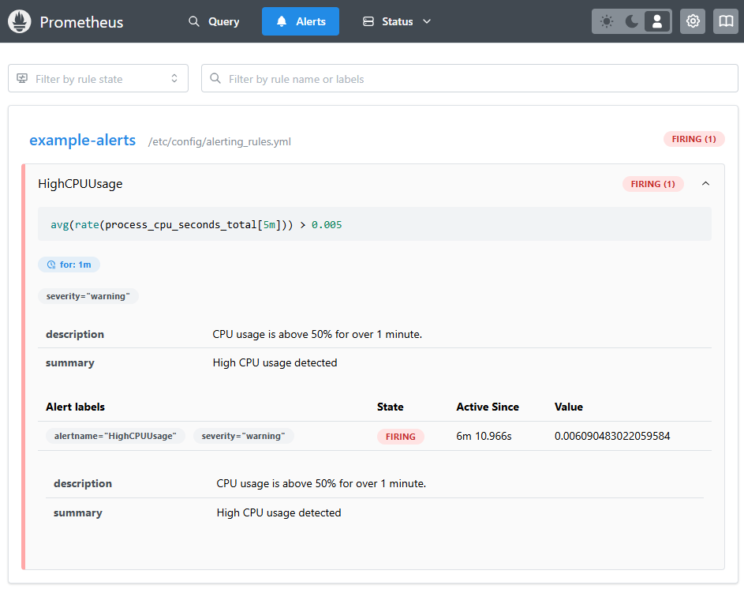
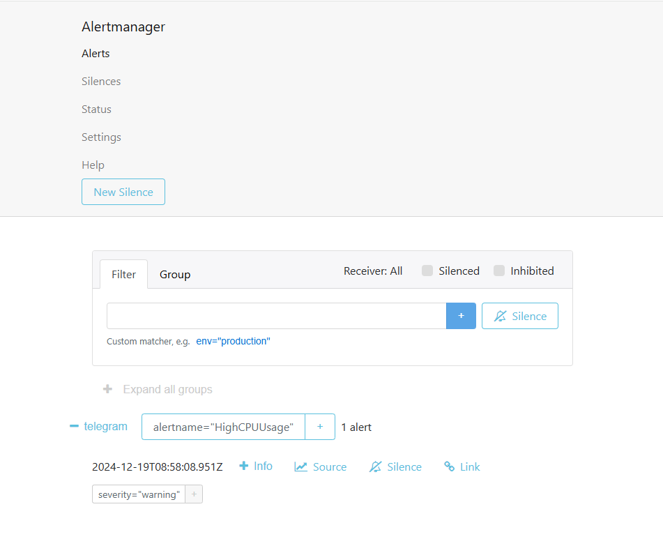
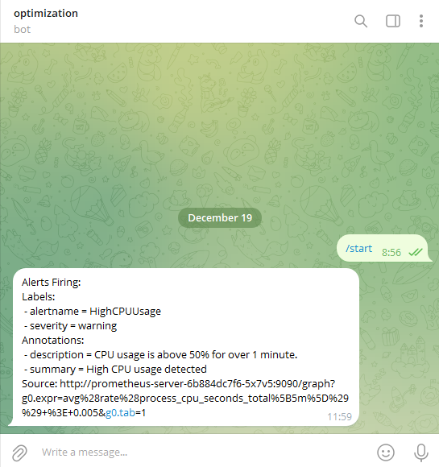

# README

## preinstall




```
minikube start
helm repo add prometheus-community https://prometheus-community.github.io/helm-charts
helm repo add grafana https://grafana.github.io/helm-charts
helm repo update
minikube dashboard
```

`alerting_rules.yml`

```yaml
apiVersion: v1
kind: ConfigMap
metadata:
  name: prometheus-server
data:
  alerting_rules.yml: |
    groups:
      - name: example-alerts
        rules:
          - alert: HighCPUUsage
            expr: avg(rate(process_cpu_seconds_total[5m])) > 0.005
            for: 1m
            labels:
              severity: warning
            annotations:
              summary: "High CPU usage detected"
              description: "CPU usage is above 50% for over 1 minute."
```

`alertmanager.yml`

```yaml
apiVersion: v1
kind: ConfigMap
metadata:
  name: prometheus-alertmanager
data:
  alertmanager.yml: |
    global:
      resolve_timeout: 5m
    receivers:
      - name: telegram
        telegram_configs:
          - bot_token: 7448889828:AAHHKCGh-Wzl9R5TZyoqKwRahmfDp7iYQ7c
            chat_id: 730200183
    route:
      receiver: telegram
      group_by: [ 'alertname' ]
      group_wait: 10s
      group_interval: 10s
      repeat_interval: 1h
```

## install

```
minikube mount ".\history:/host/history"
kubectl apply -f .\history.yaml

helm install prometheus prometheus-community/prometheus
kubectl expose service prometheus-server --type=NodePort --target-port=9090 --name=prometheus-server-ext
kubectl expose service prometheus-alertmanager --type=NodePort --target-port=9093 --name=prometheus-alertmanager-ext

kubectl apply -f alerting_rules.yml -f alertmanager.yml
kubectl delete pod prometheus-alertmanager-0

minikube service prometheus-server-ext
minikube service prometheus-alertmanager-ext
```





