# README

## preinstall

```
minikube start
helm repo add prometheus-community https://prometheus-community.github.io/helm-charts
helm repo add grafana https://grafana.github.io/helm-charts
helm repo update
```

## install prometheus

```
helm install prometheus prometheus-community/prometheus
kubectl expose service prometheus-server --type=NodePort --target-port=9090 --name=prometheus-server-ext
```

## install grafana

```
helm install grafana grafana/grafana --set adminPassword=admin
[System.Text.Encoding]::UTF8.GetString([System.Convert]::FromBase64String((kubectl get secret grafana -o jsonpath="{.data.admin-password}")))
kubectl expose service grafana --type=NodePort --target-port=3000 --name=grafana-ext
```

## start

```
minikube service prometheus-server-ext
minikube service grafana-ext
```

## configuration

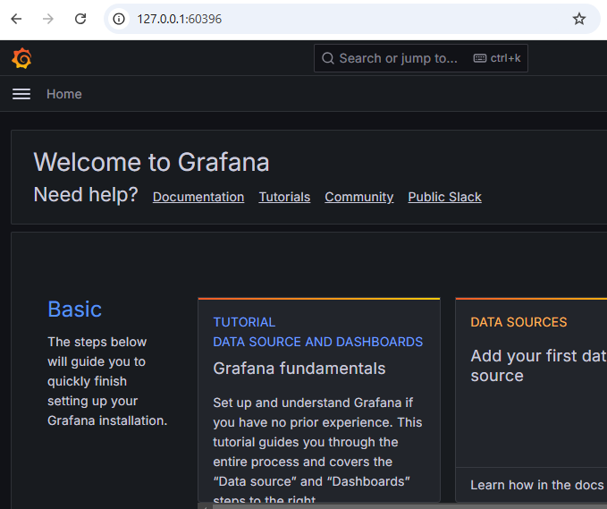
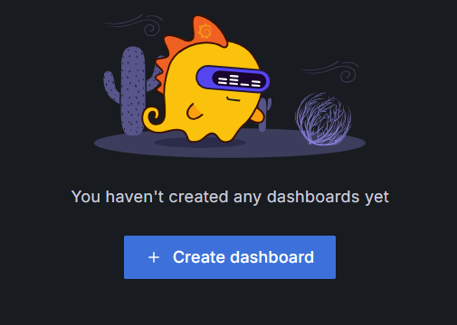
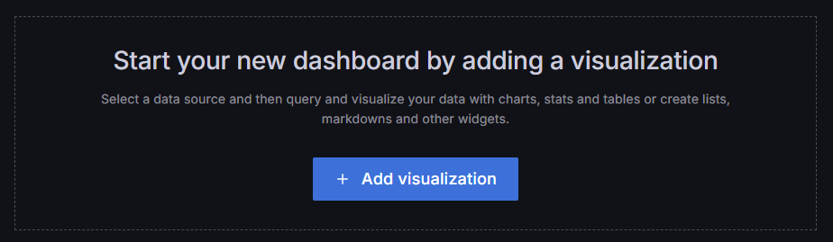
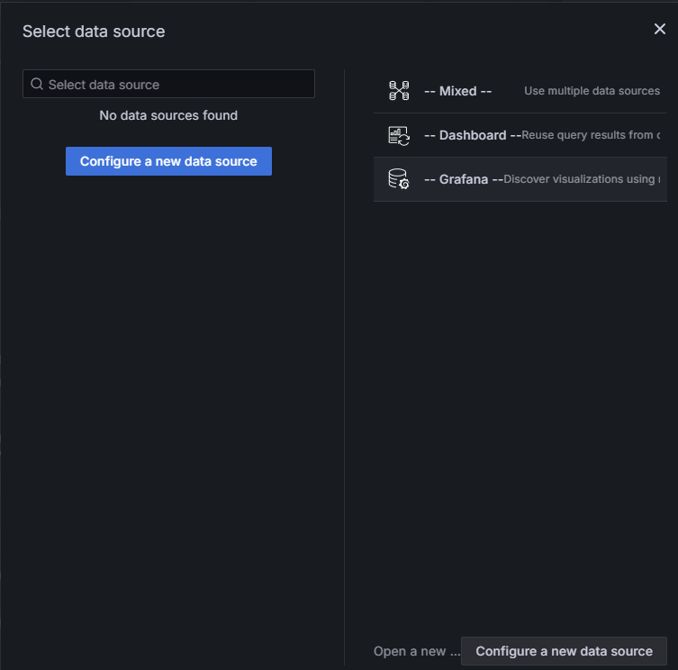
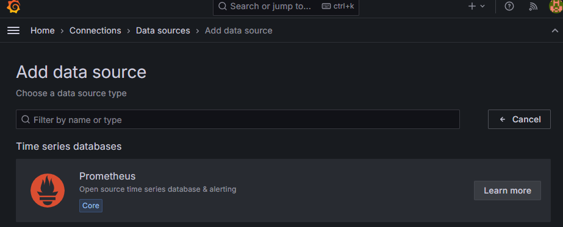
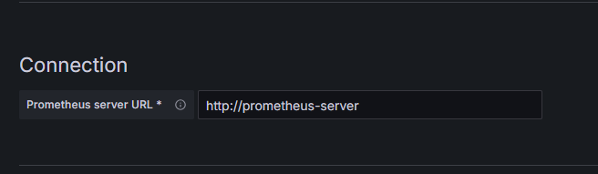
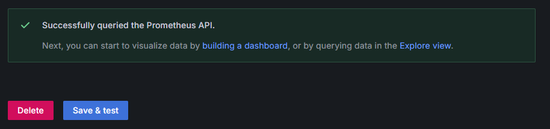
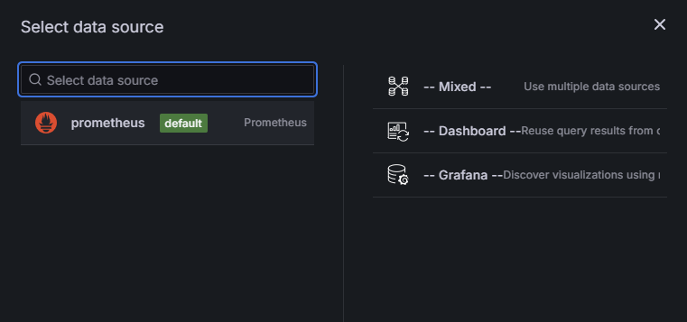
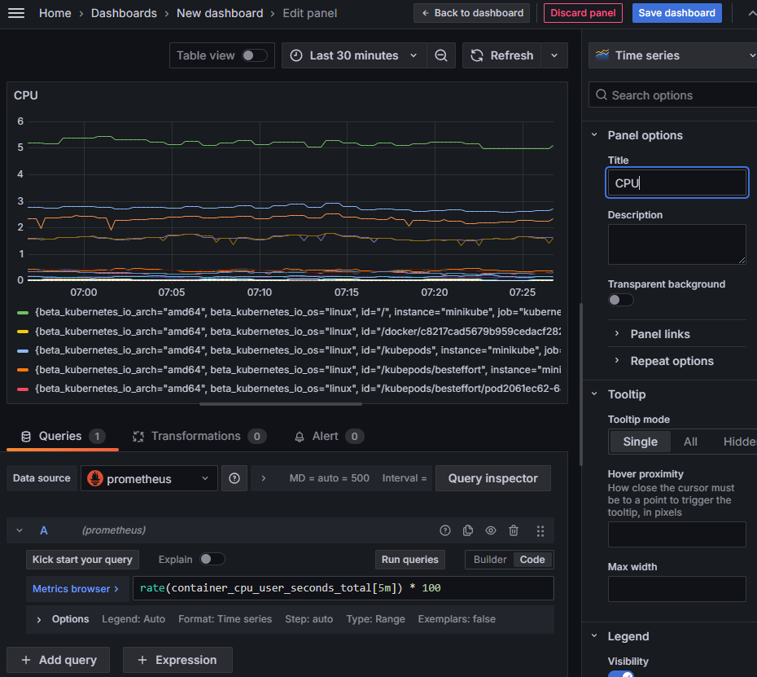
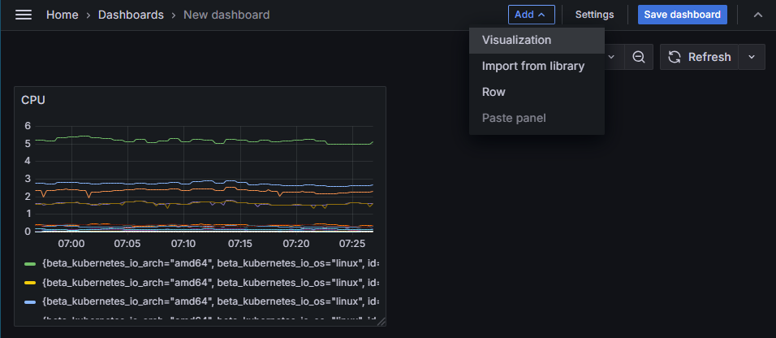
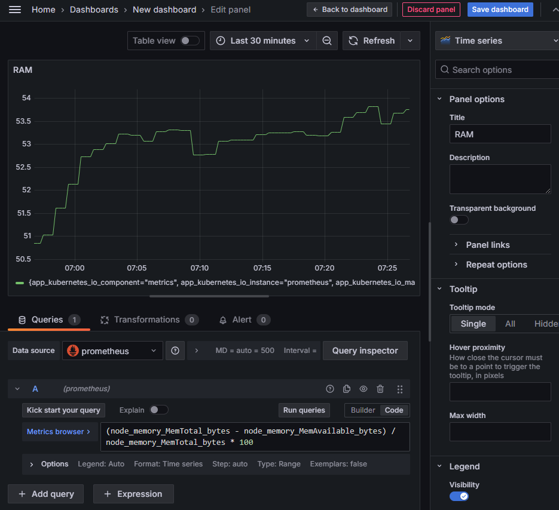
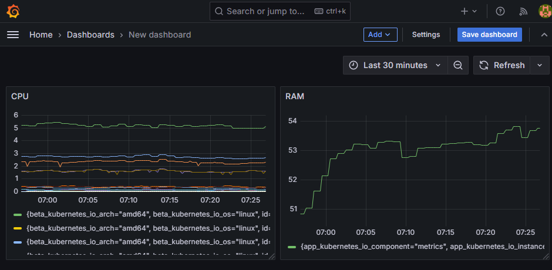
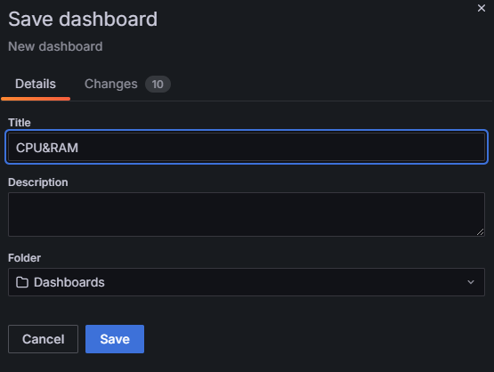
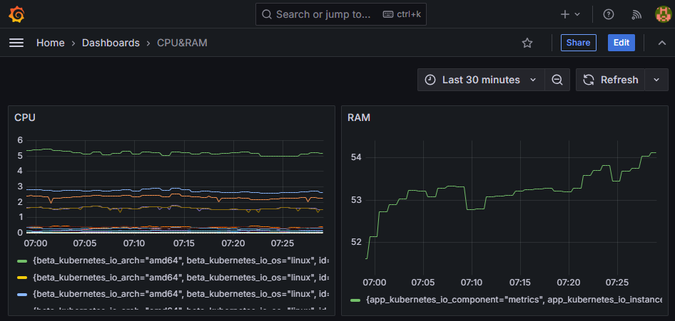
